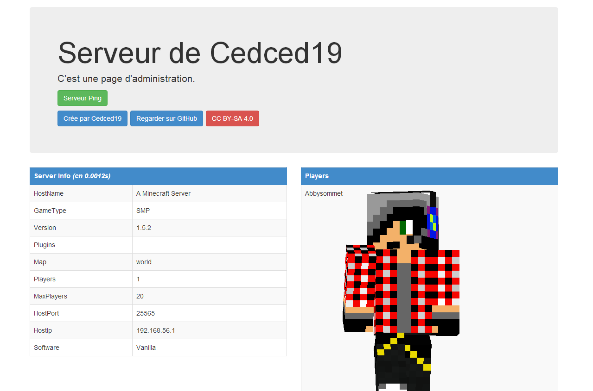

#CLaunch

Hello ! It's my Minecraft launcher, there are else the server configuration and a administration page.
Download here: [cedced19.github.io/CLaunch/Claunch.jar](http://cedced19.github.io/CLaunch/CLaunch.jar)

## Java sources

The sources are here: [/source](https://github.com/cedced19/CLaunch/tree/gh-pages/source)

## Page d'administration en php

### Description
Work since **Minecraft 1.0**

Update the **server.properties**:

> *enable-query=true*  
> *query.port=25566*  
> *enable-rcon=true*  
> *rcon.port=25567*  
> *rcon.password=ichbinpassword*  

